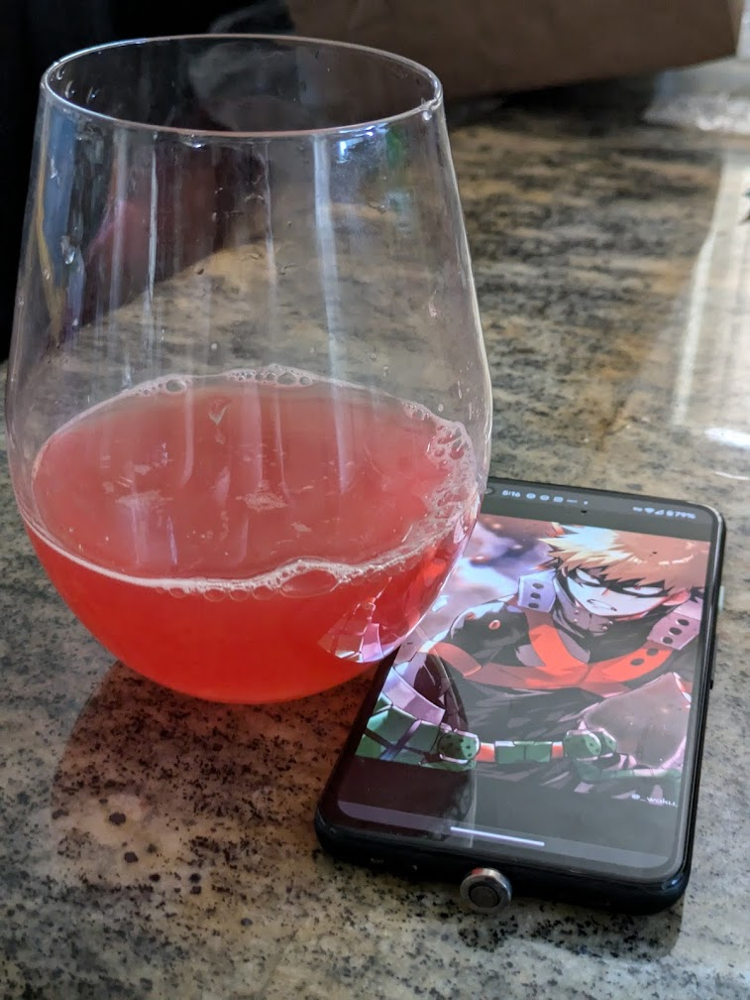

# AX Day 1: Celebrating BNHA
 Celebrating a graceful and beautiful end to Boku No Hero Academia and to our Independance Day!  `15 ea` `+5 for double shot`
 
> ### United States of Smashed
>The aesthetic symbol to celebrate  the red, white, and blue `vodka base` 
> 

 >### Deku Highball
>Unconventional underdog drink for connoisseurs that's suprisingly sippable  `whiskey base` 
> 

>### Murder God  Margarita
>Explosive strawberry margarita with Celsius caffiene to keep you getting up `tequila base`  
> 

Please vote for our independance and freedom from autocracy this November. Look up "Project 2025" to see what we are fighting against this voting season. 

 ---

# Specialty Cocktails `20 ea` 
Jinn's double shot ccktails made with premium liquor

> ### Cosmopolitan
> Grey Goose, triple sec, cranberry `Vodka base`

> ### Espresso Martini 
> Grey Goose, Stumptown espresso, Kalua, cream `Vodka base`

> ### Margarita 
> Don Julio Blanco, triple sec, lime, agave `Tequila base`

> ### Old Fashioned 
> Jack, angostura, simple syrup

---

# Poisons `15 ea` 
 Upgrade to Grey Goose/Don Julio `+5` 

> ### Cranberry Vodka 
> Upgrade to Grey Goose `+5` `vodka base`

> ### Vodka Soda/Tonic
> Upgrade to Grey Goose `+5`  `vodka base`

> ### Paloma
> Upgrade to Don Julio `+5`  `tequila base`

> ### Tequila Soda/Tonic
> Upgrade to Don Julio `+5`  `tequila base`

> ### Whiskey Coke 
>  `whiskey base`

--- 
# Potions
Keeps you going through the night
> ### Celcius Martini `15`
> Celcius energy drink, vodka, and soju flavoring `vodka base`

> ### Celsius `8`

> ### Bottled Water `5` 

---
# Beers `10`
> ### Hazy IPA

> ### Belgian White
